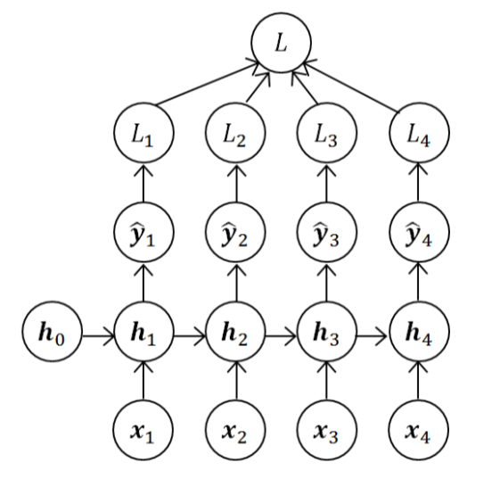
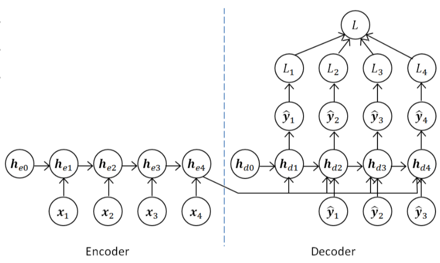

# Recurrent Neural Network

Why a normal neural network can't perform well in sequence learning task?

* Inputs, outputs can be different lengths in different examples
* Doesn't share features learned across different positions of text

## Brief Description

* RNNs can use their internal state (memory) to process sequences of inputs.
* NN with loops in it, allowing information to persist.
    * A loop allows information to be passed form one stop of the network to the next.

### Quick View

## Basic Structure

The rolled and unrolled RNN notation is equivalent.

The unrolled RNN is to represent the relationship of *time sequence*.

## Forward Propagation

notes that

* you can use different activation function for either inside RNN node or the output)
* output may use another activation funciton. i.e. $h_t$ is output to node itself's next state and the next layer node. (assume it's $\hat{y}_t$ here)
* usually in the RNN node we use *tanh / ReLU* as activation function. And use *sigmoid* to the output (based-on your task)
* all the time states share the same weights in single RNN node

$$
h_t = \tanh(W_{hh} h_{t-1} + W_{hx}x_t + b_h) \\
\hat{y_t} = \operatorname{activation(W_{yh} h_{t} + b_y)}
$$

### Simplified RNN notation

We'll concatenate the tensors for better expend to more complex model.

$$
h_t = \tanh(W_{h}[h_{t-1}, x_t] + b_h) \\
\hat{y_t} = \operatorname{activation(W_{y} h_{t} + b_y)}
$$

For $W_h = \begin{bmatrix} W_{hh} | W_{hx} \end{bmatrix}$ and $[h_{t-1}, x_t] = \begin{bmatrix} h_{t-1} \\ - \\ x_t \end{bmatrix}$

So that $\begin{bmatrix} W_{hh} | W_{hx} \end{bmatrix} \begin{bmatrix} h_{t-1} \\ - \\ x_t \end{bmatrix} = W_{hh} h_{t-1} + W_{hx}x_t$

## Back Propagation (through time)

Use Cross Entropy as an loss function

$$
Loss_t(\hat{y}_t, y_t) = -y_t \log \hat{y}_t - (1 - y_t) \log (1-\hat{y}_t) \\
Loss_t(\hat{y}_t, y_t) = \sum^{\text{time length of } y}_{t=1}(\hat{y}_t, y_t)
$$

## RNN Architectures

* Many-to-Many
    * Equal length of input and output - e.g. NER, DNA
    * Different length of input and output (Usually has an **encoder** and a **decoder**) - e.g. Machine Translation
* Many-to-One
* One-to-Many - e.g. Music Generation

> (one-to-one -> don't need to be RNN)

### Sequential Representation Model

* Output the last (time t) hidden layer

Example:

* Sentiment Analysis

### Sequential Labeling Model

* Every time hidden layer has an output

Example:

POS tagging, Chinese word segmentation

### [Sequential Transfer Model (Encoder-decoder)](../LearningFramework/seq-to-seq.md)

* Using two set of RNN

### More Architecture

#### Multi-layer RNN

#### [Bidirectional RNN](../LearningFramework/BRNN.md)

* Consider the words after current word when calculating semantic

## The Problem of Long-Term Dependencies

* It's entirely possible for the gap between the relevant information and the point where it is needed to become vary large.
* As the gap grows, RNNs become unable to learn to connect the information.

> Solution --> [LSTM](LSTM.md)

## Resources

* [Recurrent neural network](https://en.wikipedia.org/wiki/Recurrent_neural_network) (not Recursive NN)

### Tutorial

* [Andrew Ng - RNN W1L03: RNN Model](https://youtu.be/2E65LDnM2cA)
* [Andrew Ng - RNN W1L04: Backpropagation through time](https://youtu.be/esgbmJ6SnSY)
* [Andrew Ng - RNN W1L05: Different types of RNNs](https://youtu.be/G5kW3V6qHuk)

### TensorFlow

* [BasicRNNCell](https://www.tensorflow.org/api_docs/python/tf/nn/rnn_cell/BasicRNNCell)
* [RNNCell](https://www.tensorflow.org/api_docs/python/tf/nn/rnn_cell/RNNCell)
