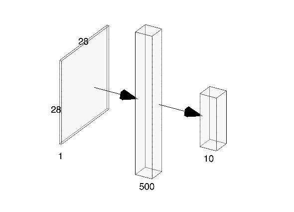

# MNIST Handwriting Digit

## Overview

### Network Structure



## Use Online Database

### Files

```txt
.
├── data (auto generate) - MNIST dataset will download here
├── mnist_app.py - input image and output number
├── mnist_backward.py - back propagation
├── mnist_forward.py - forward propagation
├── mnist_test.py - testing
├── model (auto generate) - saved model training status
├── test_picture - custom number images
└── test_picture.sh - test custom images
```

### Instructions

1. Go to project directory

    `cd Online_Database`

2. Training phase

    `python3 mnist_backward.py`

3. Testing phase (can parallel running while training)

    `python3 mnist_forward.py`

4. Custom test

    `bash test_picture.sh`

    or

    `python3 mnist_app.py path/to/image1 path/to/image2 ...`

### Result

## Use Actual Images

### Files

```txt
.
├── custom_num - custom number images
├── custom_test.sh - test custom images
├── custom_test.txt - custom image test list
├── data (auto generate) - orgnized data generate by mnist_generate_dataset.py
├── execute-in-parallel-tmux.sh - run training and testing at the same time
├── mnist_app.py - input image and output number
├── mnist_backward.py - back propagation
├── mnist_data_jpg.tar.gz - MNIST image dataset
├── mnist_forward.py - forward propagation
├── mnist_generate_dataset.py - generate TFRecord file from dataset
├── mnist_test.py - testing
└── model (auto generate) - saved model training status
```

### Instructions

1. Goto project directory

    `cd Actual_Picture`

2. Decompress the MNIST images (there are 6000 + 1000 images so it might take a while)

    `tar xzf mnist_data_jpg.tar.gz`

> [How to obtain maximum compression with .tar.gz](https://superuser.com/questions/514260/how-to-obtain-maximum-compression-with-tar-gz)

3. Generate the TFRecord file

    `python3 mnist_generate_dataset.py`

4. Train the model
    * You can use tmux to see the training and testing progress at the same time (i.e. step 5)

        `bash execute-in-parallel-tmux.sh`

    * Or just train the model

        `python3 mnist_backward.py`

5. Test with testing data (optional)

    `python3 mnist_test.py` (terminate with `Ctrl + c`)

6. Test with custom images (by default, image should be black number and white background)
    * Use my images (you can save your image paths in `custom_test.txt`)

        `bash custom_test.sh`

    * Or directly input image path

        `python3 mnist_app.py path/to/image1 path/to/image2 ...`

### Result

TBD

* Model
* Batch size
* Steps
* Learing rate
* Accuracy after xx round

TODO: try to get rid of warnings

## Links

### Article

* [Putting it all together and Classifying MNIST dataset](https://deepnotes.io/classify-mnist)
