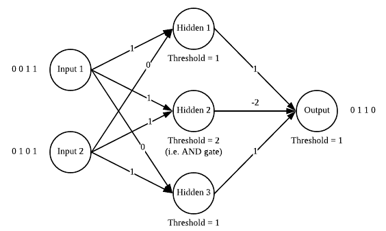

# Perceptron Practice

## Introduction


Data:

* Linear seprable: AND, OR => Single Layer Perceptron (SLP)
* Linear unseprable: XOR => Multi Layer Perceptron (MLP)

## AND, OR Model

**Structure**:


Step Function

$$
Y = \left\{ \begin{matrix} 1,\text{if }\sum_{i}^{}{a_{i}W_{i} \geq \theta} \\ 0,\text{if }\sum_{i}^{}{a_{i}W_{i} < \theta} \\ \end{matrix} \right.
$$

**Code**:

* [AND and OR](AND_OR_Perceptron.py)

### Result of AND

Training AND with one epoch of data (i.e. AND's truth table)

```txt
===== AND with init weight =====
Perceptron with
Current weight
 [ 0.2 -0.3]
Current bias
 0.4

After round 0 training
updated weight [ 0.2 -0.3] bias 0.4
After round 1 training
updated weight [ 0.2 -0.3] bias 0.4
After round 2 training
updated weight [ 0.2 -0.3] bias 0.4
After round 3 training
updated weight [ 0.3 -0.2] bias 0.30000000000000004


After training
Perceptron with
Current weight
 [ 0.3 -0.2]
Current bias
 0.30000000000000004
```

### Result of OR

Training OR with one 100 epoch of data (i.e. OR's truth table) and Show its prediction result

```txt
===== OR with random weight =====
Perceptron with
Current weight
 [-0.16267954  0.34931872]
Current bias
 0.697259461774919

Perceptron with
Current weight
 [0.23732046 0.54931872]
Current bias
 0.19725946177491913

Predict
[0 0] --> 0.0
[0 1] --> 1.0
[1 0] --> 1.0
[1 1] --> 1.0
```

## XOR Model 1

**Structure**:



**Code**:

* [XOR](XOR_MLP.py)

## XOR Model 2

Another Structure

TBD

## Resources

### Book

Deep Learning

* [Ch 6 MLP](https://www.deeplearningbook.org/contents/mlp.html)
  * Ch 6.1 Example: Learning XOR

### Article

* [Solving XOR with a single Perceptron](https://medium.com/@lucaspereira0612/solving-xor-with-a-single-perceptron-34539f395182)
* [**How To Implement The Perceptron Algorithm From Scratch In Python**](https://machinelearningmastery.com/implement-perceptron-algorithm-scratch-python/)
* [類神經網路 筆記](http://darren1231.pixnet.net/blog/post/338810666-%E9%A1%9E%E7%A5%9E%E7%B6%93%E7%B6%B2%E8%B7%AF%28backpropagation%29-%E7%AD%86%E8%A8%98)

Matlab

* [Solving XOR problem with a multilayer perceptron](http://lab.fs.uni-lj.si/lasin/wp/IMIT_files/neural/nn04_mlp_xor/)

### Slides

* [Single Layer Perceptrons](http://www.cs.stir.ac.uk/courses/ITNP4B/lectures/kms/2-Perceptrons.pdf)
