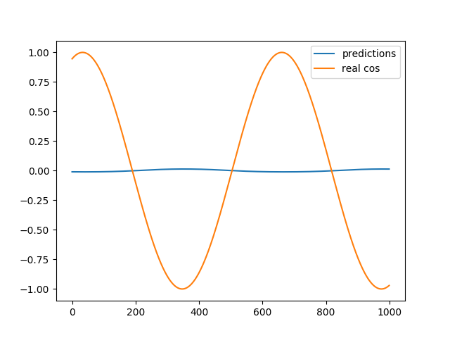
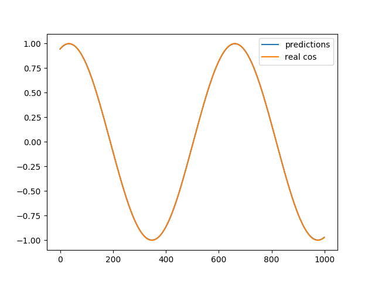
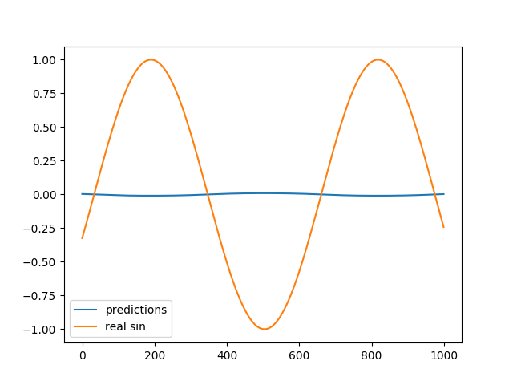
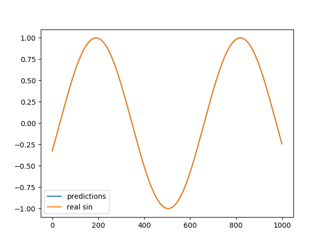

# RNN Trigonometric Function Prediction

## Usage

Training

```sh
python3 Training.py
```

* TRAINING.SINE
* TRAINING.COSINE

## Cosine

Before Train

```txt
Root Mean Square Error is: 0.735156
```



Training

```txt
train step: 0, loss: 0.5143358
train step: 1000, loss: 0.0010109798
train step: 2000, loss: 0.00018643335
train step: 3000, loss: 3.144868e-05
train step: 4000, loss: 5.688212e-06
train step: 5000, loss: 2.8767863e-06
train step: 6000, loss: 2.9899923e-06
train step: 7000, loss: 1.4363159e-06
train step: 8000, loss: 2.335294e-06
train step: 9000, loss: 2.889702e-06
```

After Train

```txt
Root Mean Square Error is: 0.001572
```



## Sine

Before Train

```txt
Root Mean Square Error is: 0.693959
```



Training

```txt
train step: 0, loss: 0.55493146
train step: 1000, loss: 0.0007582925
train step: 2000, loss: 0.00038843902
train step: 3000, loss: 6.767635e-05
train step: 4000, loss: 8.217887e-06
train step: 5000, loss: 5.877086e-06
train step: 6000, loss: 3.426523e-06
train step: 7000, loss: 4.323795e-06
train step: 8000, loss: 3.7904113e-06
train step: 9000, loss: 3.903383e-06
```

After Train

```txt
Root Mean Square Error is: 0.001863
```


