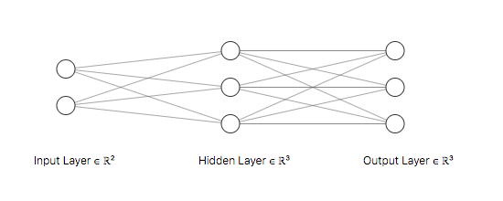

# Softmax Classification Back Propagation with Cross Entropy

## FCNN Structure



* Input
    * data
        * $\mathbb{x}$ (shape 2,)
    * label
        * $\mathbb{y}$ (shape 3,)
* Weight
    * Input -> Hidden layer
        * $\mathbb{w} = \begin{bmatrix}w_{11} & w_{12} & w_{13} \\ w_{21} & w_{22} & w_{23}\end{bmatrix}$ (shape 2x3)
* Bias
    * Hidden layer
        * $\mathbb{b} = [b_1, b_2, b_3]^T$ (shape 3,)
* Layer nodes
    * Input layer
        * $\mathbb{x} =  [x_1, x_2]^T$
    * Hidden layer
        * $\mathbb{\theta} =  [\theta_1, \theta_2, \theta_3]^T = \mathbb{w}^T\mathbb{x} + \mathbb{b}$
        * $\displaystyle \theta_k = \sum_{i=1}^3 w_{ik}x_i + b_k$
    * Output layer (Softmax)
        * $\hat{\mathbb{y}} = [\hat{y}_1, \hat{y}_2, \hat{y}_3]^T$
        * $\displaystyle\hat{y_i} = \operatorname{softmax}(\mathbb{\theta})_i = \frac{\exp(\theta_i)}{\displaystyle\sum_{j=1}^3 \exp(\theta_j)} ,\forall i=1, 2, 3$
* Loss Function: Cross Entropy
    * $J(\theta) = \operatorname{CE}(\mathbb{y}, \mathbb{\hat{y}}) = \displaystyle -\sum_{i=1}^3 y_i \log(\hat{y}_i)$
    * $\mathbb{\theta} = \mathbb{w}^T\mathbb{x} + \mathbb{b}$

## Deduction

What we want to calculate $\displaystyle\frac{\partial J(\theta)}{\partial \mathbb{w}}$ and $\displaystyle\frac{\partial J(\theta)}{\partial \mathbb{b}}$

According to chain rule we get

$$
\frac{\partial J(\mathbb{\theta})}{\partial \mathbb{w}} = \frac{\partial J(\mathbb{\theta})}{\partial \mathbb{\theta}} \frac{\partial \mathbb{\theta}}{\partial \mathbb{w}} = \frac{\partial J(\mathbb{\theta})}{\partial \mathbb{\hat{y}}} \frac{\partial \mathbb{\hat{y}}}{\partial \mathbb{\theta}} \frac{\partial \mathbb{\theta}}{\partial \mathbb{w}}
$$

$$
\frac{\partial J(\mathbb{\theta})}{\partial \mathbb{b}} = \frac{\partial J(\mathbb{\theta})}{\partial \mathbb{\theta}} \frac{\partial \mathbb{\theta}}{\partial \mathbb{b}} = \frac{\partial J(\mathbb{\theta})}{\partial \mathbb{\hat{y}}} \frac{\partial \mathbb{\hat{y}}}{\partial \mathbb{\theta}} \frac{\partial \mathbb{\theta}}{\partial \mathbb{b}}
$$

So we first calculate derivative of the softmax function

$$
\frac{\partial \hat{y_i}}{\partial \theta_i} = \frac{\partial\frac{\exp(\mathbb{\theta}_i)}{\sum_j \exp(\mathbb{\theta}_j)}}{\partial \theta_i} ,\forall i = 1, 2,3
$$

(define $\sum_K = \displaystyle\sum_{j=1}^{K}\exp(\theta_j)$, in this case K = 3)

Consider two different cases

$i = j$

$$
\frac{\partial \mathbb{\hat{y_i}}}{\partial \theta_i} = \frac{\partial \frac{\exp(\theta_i)}{\sum_K}}{\partial \theta_i} = \frac{\exp(\theta_i)\sum_K - \exp(\theta_i)\exp(\theta_i)}{(\sum_K)^2} \\
= \frac{\exp(\theta_i)}{\sum_K} \frac{\sum_K - \exp(\theta_i)}{\sum_K} = \frac{\exp(\theta_i)}{\sum_K}(1-\frac{\exp(\theta_i)}{\sum_K}) \\
= \hat{y}_i (1-\hat{y}_i)
$$

$i \neq j$

$$
\frac{\partial \mathbb{\hat{y_i}}}{\partial \theta_j} = \frac{\partial \frac{\exp(\theta_i)}{\sum_K}}{\partial \theta_j} = \frac{0- \exp(\theta_i)\exp(\theta_j)}{(\sum_K)^2} \\
= -\frac{\exp(\theta_i)}{\sum_K} \frac{\exp(\theta_j)}{\sum_K} = -\hat{y_i}\hat{y_j}
$$

> Note that if i = j this derivative is similar to the derivative of the logistic function.

Then we calculate the derivative of the cross-entropy loss function for the softmax function.

$$
\frac{\partial J(\mathbb{\theta})}{\partial \theta_i} = -\sum_{j=1}^K \frac{\partial y_j \log(\hat{y}_j)}{\partial \theta_i} = -\sum_{j=1}^K y_j \frac{\partial \log(\hat{y}_j)}{\partial \theta_i} = -\sum_{j=1}^K \frac{y_j}{\hat{y}_j} \frac{\partial \hat{y}_j}{\partial \theta_i} \\
= (-\frac{y_i}{\hat{y}_i} \frac{\partial \hat{y}_i}{\partial \theta_i}) + (-\sum_{j\neq i}^K \frac{y_j}{\hat{y}_j} \frac{\partial \hat{y}_j}{\partial \theta_i}) = -\frac{y_i}{\hat{y}_i} \hat{y}_i (1-\hat{y}_i) -\sum_{j\neq i}^K \frac{y_j}{\hat{y}_j} (-\hat{y_i}\hat{y_j}) \\
= -y_i + y_i \hat{y}_i + \sum_{j\neq i}^{K} y_j \hat{y}_i = -y_i + \sum_{j=1}^K y_j \hat{y_i} = - y_i + \hat{y_i} \sum_{j=1}^K y_j \\
= \hat{y_i} - y_i
$$

($\because \mathbb{y}$ in classification is one-hot vector $\therefore \displaystyle\sum_{j=1}^K y_j = 1$)

Lets find out $\displaystyle\frac{\partial J(\theta)}{\partial \mathbb{w}}$ and $\displaystyle\frac{\partial J(\theta)}{\partial \mathbb{b}}$

Because

$$
\frac{\partial \mathbb{\theta}}{\partial \mathbb{w}} = \frac{\partial (\mathbb{w}^T\mathbb{x} + \mathbb{b})}{\partial \mathbb{w}} = \mathbb{x}^T
$$

and

$$
\frac{\partial \mathbb{\theta}}{\partial \mathbb{b}} = \frac{\partial (\mathbb{w}^T\mathbb{x} + \mathbb{b})}{\partial \mathbb{b}} = 1
$$

So we found that

$$
\frac{\partial J(\theta)}{\partial \mathbb{w}} = \mathbb{x}^T(\mathbb{\hat{y}} - \mathbb{y})
$$

$$
\frac{\partial J(\theta)}{\partial \mathbb{b}} = \mathbb{\hat{y}} - \mathbb{y}
$$

## Example

### With custom initial value

* Weight & Bias
    * $\mathbb{w}$ = 0.5 for all w
    * $\mathbb{b}$ = 1 for all b
* Input
    * $\mathbb{x} = [8, 7]$
    * $\mathbb{y} = [0, 0, 1]$

**Result**:

```txt
Round: 0
Current loss: [[1.9095425]]
Current weight:
 [[0.5 0.5 0.5]
 [0.5 0.5 0.5]]
Current bias:
 [[1]
 [1]
 [1]]
Round: 1
Current loss: [[2.99760217e-15]]
Current weight:
 [[-2.16666667 -2.16666667  5.83333333]
 [-1.83333333 -1.83333333  5.16666667]]
Current bias:
 [[0.66666667]
 [0.66666667]
 [1.66666667]]
======= Finish Training ======
After 1 round training
Final eight:
 [[-2.16666667 -2.16666667  5.83333333]
 [-1.83333333 -1.83333333  5.16666667]]
Final bias:
 [[0.66666667]
 [0.66666667]
 [1.66666667]]
Final loss: [[2.99760217e-15]]
y_hat =
 [[3.09335001e-50]
 [3.09335001e-50]
 [1.00000000e+00]]
```

### With random initial value

* Weight & Bias
    * $\mathbb{w}$ = random uniform distribution 0~1
    * $\mathbb{b}$ = 0 for all b
* Input
    * $\mathbb{x} = [8, 7]$
    * $\mathbb{y} = [0, 0, 1]$

**Result**:

```txt
Round: 0
Current loss: [[0.46077411]]
Current weight:
 [[-0.03010464 -0.48454925 -0.19359648]
 [-0.48489008 -0.29742846 -0.09327472]]
Current bias:
 [[0.]
 [0.]
 [0.]]
Round: 1
Current loss: [[3.02091685e-13]]
Current weight:
 [[-1.54217344 -0.63265234  1.46657541]
 [-1.80795027 -0.42701866  1.35937568]]
Current bias:
 [[-0.1890086 ]
 [-0.01851289]
 [ 0.20752149]]
======= Finish Training ======
After 1 round training
Final eight:
 [[-1.54217344 -0.63265234  1.46657541]
 [-1.80795027 -0.42701866  1.35937568]]
Final bias:
 [[-0.1890086 ]
 [-0.01851289]
 [ 0.20752149]]
Final loss: [[3.02091685e-13]]
y_hat =
 [[5.56493009e-21]
 [1.50529585e-13]
 [1.00000000e+00]]
```

## Links

### Article

Softmax & Cross Entropy

* [**Softmax classification with cross-entropy**](https://peterroelants.github.io/posts/cross-entropy-softmax/)
* [**Classification and Loss Evaluation - Softmax and Cross Entropy Loss**](https://deepnotes.io/softmax-crossentropy)
* [Backpropagation with Softmax / Cross Entropy](https://stats.stackexchange.com/questions/235528/backpropagation-with-softmax-cross-entropy)
* [Derivative of Softmax loss function](https://math.stackexchange.com/questions/945871/derivative-of-softmax-loss-function)
* [The Softmax function and its derivative](https://eli.thegreenplace.net/2016/the-softmax-function-and-its-derivative/)
* [CSDN - 【深度學習】：超詳細的Softmax求導](https://blog.csdn.net/bqw18744018044/article/details/83120425)

Softmax in Python

* [CODE Q&A Solved - How to implement the Softmax function in Python](https://code.i-harness.com/en/q/2159492)
* [Stack Overflow - How to implement the Softmax function in Python](https://stackoverflow.com/questions/34968722/how-to-implement-the-softmax-function-in-python)